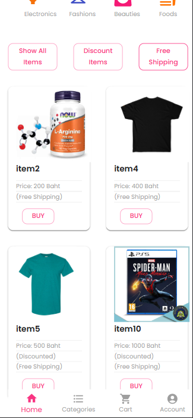
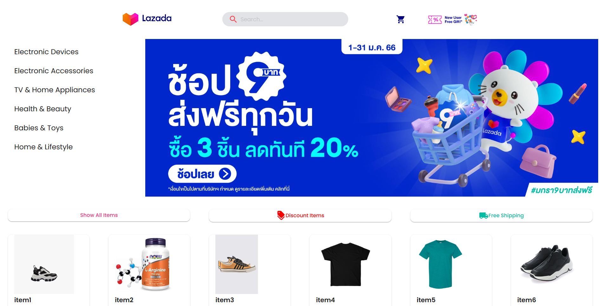
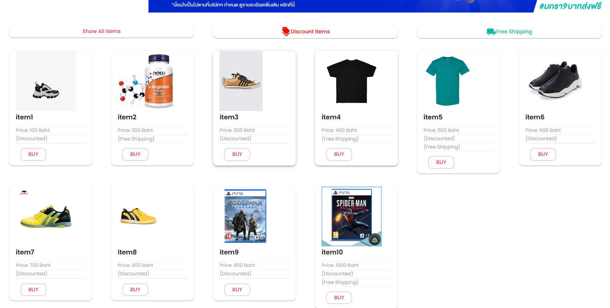
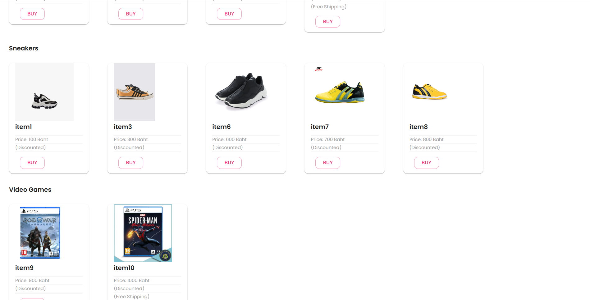
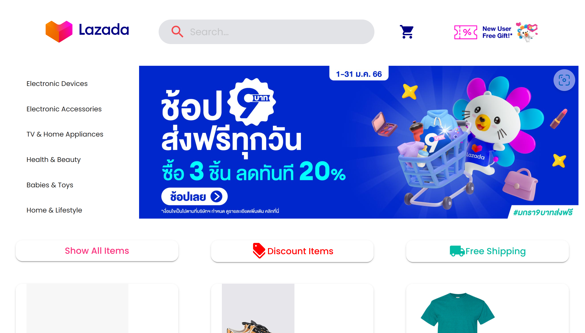
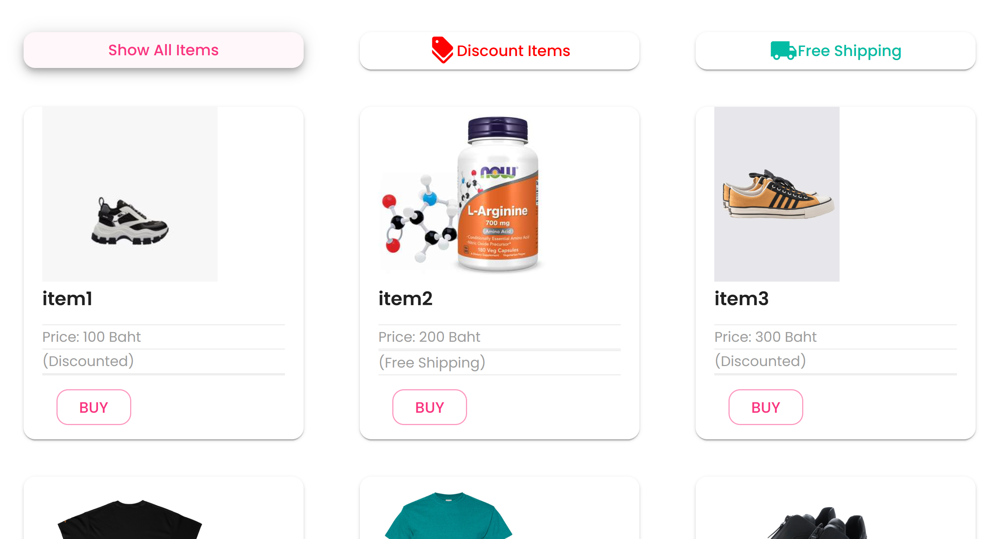
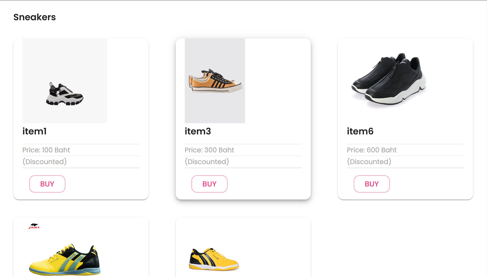

# ecommerce-frontend-clone
React responsive ecommerce frontend clone:

Mobile View: 

Destop View (Large):

Destop View (Medium):

Implemented functionality:
- .map mock data into grid component
- .filter by categories
- useState to handle buttons and simple hovering.

- Using UI/Theme manager: Material-UI
- Redux initialized (but still not be used. Planing to use to create cart functionality but not complete due to time limit.)
